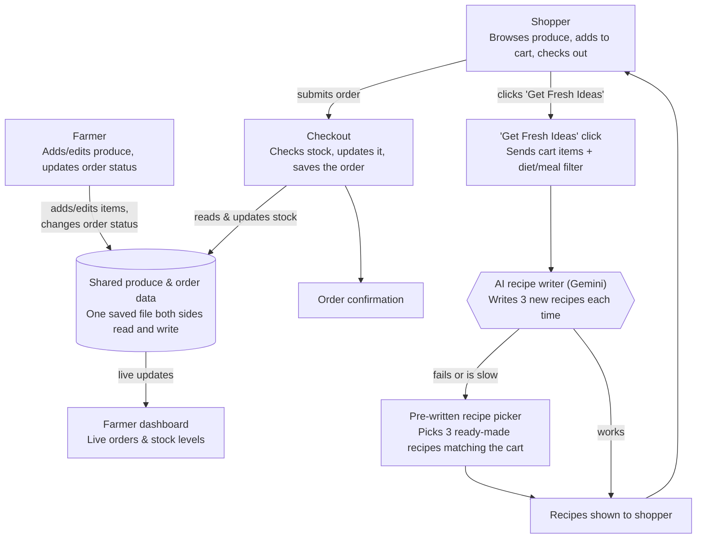

# How Willow Farm Stand Works

This page explains the app for anyone who isn't a programmer — what happens when a shopper or farmer uses it, and where the AI is involved.

## Walkthrough

**Two kinds of people use this app:** a **shopper**, buying produce, and a **farmer**, managing what's for sale. Both are looking at the same web page with different views — no separate app or login.

### Where information comes in

- The **shopper** types their name, phone, pickup/delivery info, and picks what's in their cart.
- The **farmer** types in new produce details and moves orders through their stages (New → Packing → Ready → Completed).

Everything either of them enters is saved to **one shared list**, so a purchase or a price change shows up instantly on the other side — nobody has to refresh.

### The parts that always behave the same way (no AI)

Plain rules, same input always gives the same output:
- Checking stock before letting someone buy, then subtracting it
- Adding up an order's total
- Moving an order through its status stages
- The **pre-written recipe picker** — about 7 fixed recipes matched to the cart by simple keyword matching (e.g., "tomato" and "basil" points to the tomato pasta recipe)

### The one part that uses AI, and can vary

Clicking **"Get Fresh Ideas"** sends a request to Google's Gemini AI to write three new recipes. This is the only part where the answer isn't fixed — asking twice can give two different results.

**What the AI is given:** each cart item's name, quantity, unit, category, and harvest note, plus any diet/meal filter chosen.

**What the AI never sees:** the shopper's name, phone, email, or address; past orders; or anything from the farmer's side (inventory, revenue, etc.). It only ever sees a plain grocery list and a filter choice.

**If the AI is slow, down, or unusable**, the app quietly falls back to the pre-written recipe picker — the shopper just sees a badge saying "AI Farm Chef" or "Willow Creek Kitchen" depending on which one answered.

### What the shopper gets back

- After checkout: an **order confirmation** (no payment taken — it's a request the farmer fulfills separately).
- After "Get Fresh Ideas": **three recipes**, AI-written or pre-written, with prep time, steps, and a tip.
