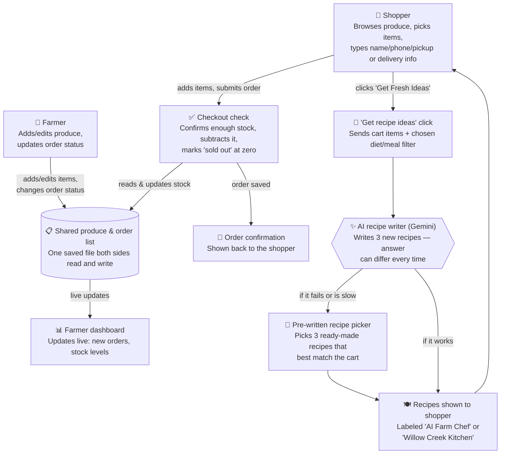

# How Willow Farm Stand Works

This page explains the app for anyone who isn't a programmer — what happens when a shopper or farmer uses it, and where the AI is involved.

## Walkthrough

**Two kinds of people use this app:** a **shopper**, buying produce, and a **farmer**, managing what's for sale. Both are just looking at the same web page with different views — there's no separate app or login involved.

### Where information comes in

- The **shopper** types their name, phone number, and either a pickup time or delivery address, and picks what's in their cart.
- The **farmer** types in new produce details (name, price, stock, description) and clicks buttons to move orders along (New → Packing → Ready → Completed).

Everything either of them enters gets saved to **one shared list** (like a shared spreadsheet). That's why a shopper buying the last bunch of kale shows up instantly on the farmer's screen, and a price change by the farmer shows up instantly for shoppers — nobody has to refresh or sync anything.

### The parts that always behave the same way (no AI)

These are just plain rules, like a calculator — same input always gives the same output:
- Checking if there's enough stock before letting someone buy
- Subtracting what was bought and marking something "sold out"
- Adding up an order's total
- Moving an order through its status stages
- The **pre-written recipe picker** — a fixed list of about 7 recipes that gets matched to whatever's in the cart using simple keyword matching (e.g., "tomato" and "basil" in the cart points to the tomato pasta recipe)

### The one part that uses AI, and can vary

When a shopper clicks **"Get Fresh Ideas"** in the recipe feature, the app sends a request to Google's Gemini AI asking it to write three brand-new recipes. This is the only part of the app where the answer isn't fixed — ask twice, and you may get two different sets of recipes, because the AI is generating fresh text each time rather than picking from a list.

**What the AI is given:**
- The name, quantity, unit, category, and harvest note of each item currently in the cart (e.g., "Tomatoes (टमाटर), 3 lb, Category: Vegetable, Note: Vine-ripened, picked this morning")
- Whatever dietary or meal-type filter the shopper picked (like "Vegetarian" or "Breakfast & Brunch")

**What the AI is never given:**
- The shopper's name, phone number, email, or delivery address
- Anything about past orders or other shoppers
- Anything from the farmer's side of the app (inventory counts, revenue, etc.)

In other words, the AI only ever sees a plain grocery list and a filter choice — nothing that identifies who's asking.

**If the AI is slow, down, or sends back something unusable**, the app quietly switches to the pre-written recipe picker instead, so the shopper never sees an error — just a small badge on the result that says either "AI Farm Chef" (real AI) or "Willow Creek Kitchen" (pre-written).

### What the shopper gets back

- After checkout: an **order confirmation** summarizing what they ordered (no payment is actually taken — it's a request the farmer fulfills separately).
- After clicking "Get Fresh Ideas": **three recipes** — either freshly written by AI or pulled from the pre-written set — with prep time, steps, and a tip, that they can copy or print.
